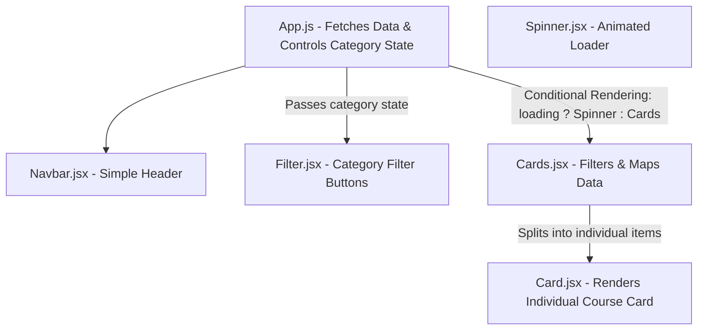

# 🎓 Top Course Finder App

An interactive, modern React application designed to browse, filter, and favorite educational courses across various domains. Fetches live data from a REST API, supports category filtering, and implements a stateful favorites system complete with dynamic toast alerts.

---

## ✨ Features

- **🌐 Async API Integration**: Fetches course data dynamically from a remote API endpoint inside React lifecycle hooks.
- **🏷️ Multi-Category Filtering**: Interactively filters courses across domains (e.g., *Development*, *Business*, *Design*, *Lifestyle*) using state-lifting.
- **❤️ Favorites/Likes System**: Toggles bookmarking with localized state logic, updating visual representations dynamically.
- **🔔 Premium Notifications**: Built-in event alerts powered by `react-toastify` for adding or removing course likes.
- **🌀 Dynamic Loading State**: A custom-animated CSS loading spinner is displayed during the data fetching transition.
- **🎨 Modern Dark Mode UI**: Built using custom dark themes and grid layouts styled with utility-first Tailwind CSS.

---

## 🛠️ Technology Stack

- **Core**: React 18
- **Styling**: Tailwind CSS
- **Notifications**: `react-toastify`
- **Icons**: `react-icons`

---

## 📐 Architecture & Components

The application follows a clean component structure with robust data flow:



### Component Breakdown
1. **`App.js`**: Fetches the API data on mount via `useEffect`, handles the global loading state, and controls the active filter category state.
2. **`Navbar.jsx`**: A simple, elegant layout header to keep the application modular.
3. **`Filter.jsx`**: Renders responsive action buttons for each course category.
4. **`Cards.jsx`**: Aggregates all courses from the API response and filters them based on the selected category before mapping.
5. **`Card.jsx`**: Renders the individual course details, custom favorite button toggles, and manages the like/unlike actions with Toastify alerts.
6. **`Spinner.jsx`**: Renders a visually premium loading spinner.

---

## 🚀 Getting Started

Follow these steps to run the application locally on your computer:

### 1. Prerequisites
Ensure you have [Node.js](https://nodejs.org/) installed (v16 or higher recommended).

### 2. Clone the Repository
```bash
git clone https://github.com/moosarehan/react-learning-journey.git
cd react-learning-journey/top-course-starter
```

### 3. Install Dependencies
```bash
npm install
```

### 4. Run the App
```bash
npm start
```
The app will launch in your browser at `http://localhost:3000`.
