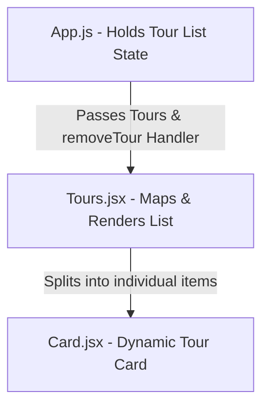

# ✈️ Plan With Love - Tourism Plan App

A beautiful, interactive React application designed to help users explore and manage vacation tour plans. Built to master React fundamentals including hooks (`useState`), state-lifting, props passing, mapping lists, and interactive UI filtering.

---

## ✨ Features

- **🌅 Dynamic Tour Cards**: Displays stunning destination images, package prices, titles, and details.
- **📖 Expandable Descriptions**: Long description text is truncated by default to 200 characters with an interactive `Read More / Show Less` toggle.
- **❌ Interactive Filters**: A `"Not Interested"` button on each card dynamically removes tours from the display using React state-lifting.
- **🔄 Full Refresh Option**: When no tours are left in the list, the app displays a custom fallback screen with a **Refresh** button to reload the tour list instantly.
- **📱 Fully Responsive Design**: Seamlessly adjusts to mobile, tablet, and desktop viewports.

---

## 🛠️ Technology Stack

- **Core**: React 18
- **Styling**: Vanilla CSS (Custom responsive layout, card hover micro-animations, premium box shadows)
- **Icons**: React Icons (used in custom elements)

---

## 📐 Architecture & Components

The application follows a modular and clean React component hierarchy:



### Component Breakdown
1. **`App.js`**: Holds the main state containing the tours array, provides the `removeTour` handler, and renders the refresh screen when `tours.length === 0`.
2. **`Tours.jsx`**: A wrapper component that layouts all individual cards in a grid and forwards props.
3. **`Card.jsx`**: Handles local state (`readmore` toggling) and presents card UI including the custom `onClick` handler to discard individual tours.

---

## 🚀 Getting Started

Follow these steps to run the application locally on your computer:

### 1. Prerequisites
Ensure you have [Node.js](https://nodejs.org/) installed (v16 or higher recommended).

### 2. Clone the Repository
```bash
git clone https://github.com/moosarehan/react-learning-journey.git
cd react-learning-journey/tourism-plan
```

### 3. Install Dependencies
```bash
npm install
```

### 4. Run the App
```bash
npm start
```
The app will launch in your browser at `http://localhost:3000` (or `http://localhost:3004` if running with custom port configuration).
